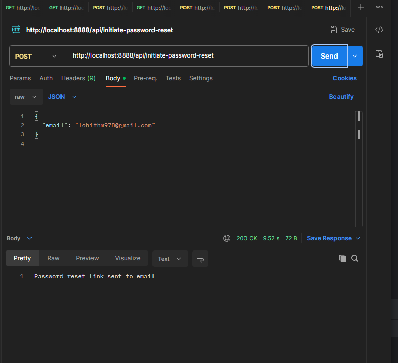
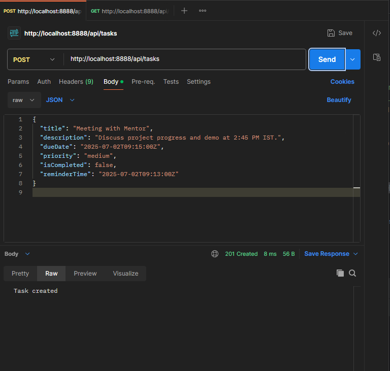

# 23IOTA10

## Designed and implement a secure, scalable Java-based To-Do List Application using MongoDB,java 17,maven,redis insight/cli


### Project Directory Structure


```
src
└── main
    └── java
        └── in
            └── edu
                └── kjc
                    ├── configs
                    │   ├── MongoConfig.java      # MongoDB client configuration
                    │   └── RedisConfig.java      # Redis client configuration
                    ├── handlers
                    │   ├── AuthHandler.java      # Handles registration, login, logout, password reset
                    │   └── TaskHandler.java      # Handles CRUD and other task-related HTTP routes
                    ├── services
                    │   ├── AuthService.java      # Business logic for auth, JWT, Redis token management
                    │   ├── TaskService.java      # Business logic for task operations and reminders
                    │   ├── MailService.java      # Async email sending service
                    │   └── RedisService.java     # Redis operations for JWT management
                    └── Main.java                 # Entry point, bootstraps Vert.x and registers routes

```
## Technologies Used
- **Java 17**: Programming language for the application.
- **Maven**: Build tool for managing dependencies.
- **Vert.x**: toolkit for building asynchronous applications.
- **MongoDB**: NoSQL database for storing user accounts and tasks.
- **Redis**: In-memory data store for managing JWT tokens and session state.
- **Bcrypt**: Password hashing library for secure password storage.
- **SMTP**: For sending emails asynchronously (e.g., password reset, task reminders).
## Overview
### 1. User Registration & Account Management

   Users register with email.

   On registration:
   - A strong, random password is generated.
   - The password is hashed using Bcrypt.
   - It is stored securely in MongoDB.
   - The password is sent to the user asynchronously via email using SMTP.
   - Duplicate email registrations are prevented.
   - Password reset is supported using a secure, time-limited reset token emailed to the user.


#### register user with email and password

#### register user with mongodb with hashed password

#### prevent duplicate registration

#### password reset with email

#### password reset with email and code

#### password reset with new password


### 2. Secure Authentication
   - JWT (JSON Web Tokens) are used for all API authentication.

   - JWTs are stored in Redis with expiration time for session management.

   - Users log in with their email and password, and receive a valid JWT token.

   - A refresh endpoint is implemented to extend token lifespan securely.

   - Logout and password reset operations invalidate the JWT in Redis to ensure security.
#### redis cli and redis insight showing validity of JWT token


#### login with email and password amd generate JWT token

#### logout and invalidate JWT token


3. To-Do Task Management

   - Users can create, edit, delete, and view their own tasks.

   Task fields include:

        Title

        Description

        Due Date

        Priority

        Completion Status (true/false)

        Timestamps (createdAt, updatedAt)

   All tasks are private to the authenticated user (secured via JWT).

   Users can toggle task completion state.

   Reminder emails are sent asynchronously before the due time if a reminder is set.

   Tasks can be listed with:

        Pagination (page, size)

        Filters (by status)

        Sorting (by field and order)

#### create new task FOR USER1

#### task created with body

#### task created with JWT token(authorization)

#### get all tasks for USER1

#### Task completion toggle

#### Task reminder email


#### pagination and sorting


## API Endpoints

### User Authentication and Account Management

| Method | Endpoint                     | Description                      | Example Request Body | Example Response                      |
|--------|------------------------------|----------------------------------|----------------------|---------------------------------------|
| POST   | `/register`                  | Register new user                | `{ "email": "user@example.com" }` | Password sent to your email |
| POST   | `/login`                     | Login and receive JWT token      | `{ "email": "user@example.com", "password": "abc123xyz" }` | `{ "token": "JWT_TOKEN" }`           |
| POST   | `/logout`                    | Logout and invalidate JWT token  | Header: `Authorization: Bearer JWT_TOKEN` | Logged out                  |
| POST   | `/token/refresh`             | Refresh expired JWT              | `{ "token": "old_jwt_token" }` | `{ "token": "new_jwt_token" }`       |

### Password Reset

| Method | Endpoint                     | Description                      | Example Request Body | Example Response                      |
|--------|------------------------------|----------------------------------|----------------------|---------------------------------------|
| POST   | `/password-reset/initiate`   | Send reset link to email         | `{ "email": "user@example.com" }` | Reset link sent             |
| POST   | `/password-reset/complete`   | Complete reset with token        | `{ "token": "reset_token", "newPassword": "newPass123" }` |  Password reset successful  |

### To-Do Task Management (JWT Required)

| Method | Endpoint                     | Description                      | Example Request Body | Example Response     |
|--------|------------------------------|----------------------------------|-|----------------------|
| POST   | `/api/tasks`                 | Create task                      | `{ "title": "Buy Milk", "description": "At 5pm", "reminderTime": "2025-07-02T14:45:00Z" }` |  Task created |
| PUT    | `/api/tasks/:id`             | Edit task                        | `{ "title": "Updated", "description": "Updated Desc" }` | Task updated |
| PUT    | `/api/tasks/:id/done`        | Toggle task completion           | | Task status toggled |
| DELETE | `/api/tasks/:id`             | Delete a task                    ||  Task deleted       |


**Steps to Generate a Google App Password**

1. **Login** to your Google Account
2. Go to the Security tab.
3. find and click **App Passwords** under "Signing in to Google". .
4. For "Select device"and enter a name.
5. Click generate.
6. Copy the 16-character password shown use it in the project.


> note:- 
> - didnt use environment variables for sensitive data like email and password, as not specifiied  
> - used port 8888 instead of 8080 as 8080 was already in use by another application.  
> - default port for mongodb is 27017 and redis is 6379
> 
This project is a educational task given to **23IOTA10**
